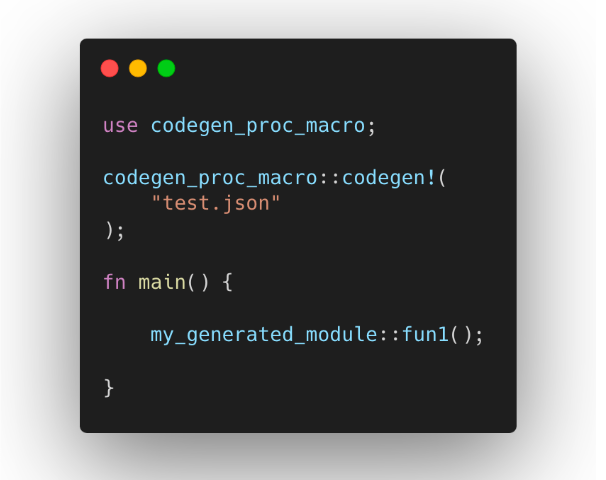

# Hydrogen Labs

### Coding Challenge: Procedural Macro for Dynamic Rust Code Generation from JSON 

## Objective
Create a Rust procedural macro that reads a JSON file and generates Rust functions based on its contents. The challenge is dynamically creating Rust functions at compile time, based on the names specified in a JSON file. This should take you 1-3 hours to complete.

## Background
Procedural macros in Rust are powerful tools for metaprogramming, allowing developers to write code that generates other code during compilation. In this challenge, you will harness this capability to create a procedural macro that reads a list of function names from a JSON file and generates corresponding Rust functions.

## Requirements
JSON File Format
The JSON file will have a specific format, like so:
Copy this json for testing:
    ```json
    {
        "methods": [
            "fun1",
            "fun2",
            "fun3"
        ]
    }
    ```
Each entry in the "methods" array is a string representing a function name.

## Function Implementation: 
Each generated function should print a simple message to the console, indicating it has been called. For example, calling fun1() should print something like "Function fun1 called".



You should be producing something to this effect. 

## Error Handling: 
Implement basic error handling for file reading and JSON parsing.

## Testing: 
Provide an example usage of the macro in a Rust program, where the generated functions are called in the main function.

# Evaluation Criteria
Correctness: The macro should correctly generate the functions as specified in the JSON file.
Error Handling: The macro should not panic; instead, it should handle errors gracefully.
Code Quality: The code should be well-organized, and readably written.
Documentation: Include comments and documentation explaining how your macro works.

# Submission Instructions
- Create a private GitHub repo and add @diyahir and @meirbank as contributors
- A small readme on running the tests
- Send an email to diyahir@hydrogenlabs.xyz upon completion with a link to the repo
